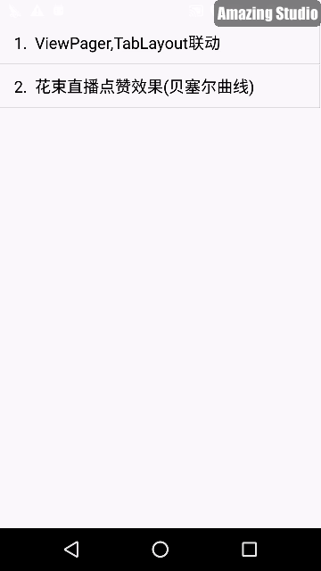

### Android Collection

1. viewPager和tablayout联动(DesignActivity)

2. 花束直播点赞效果(贝塞尔曲线:BesselActivity)
    > [贝塞尔曲线](http://blog.csdn.net/cdnight/article/details/48468653) 
    

3. 可折叠toolbar,瀑布流

4. Recyclerview的刷新加载
    >自定义URecyclerview 实现刷新加载特效

5. 6.0权限的使用

6. snackbar,floatbutton,雾化效果

7. 图片OOM处理